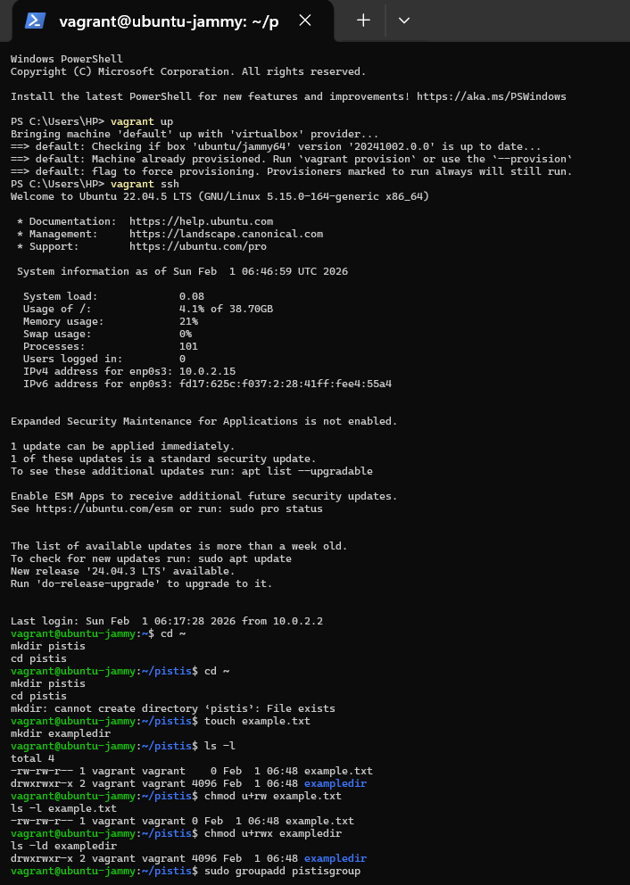
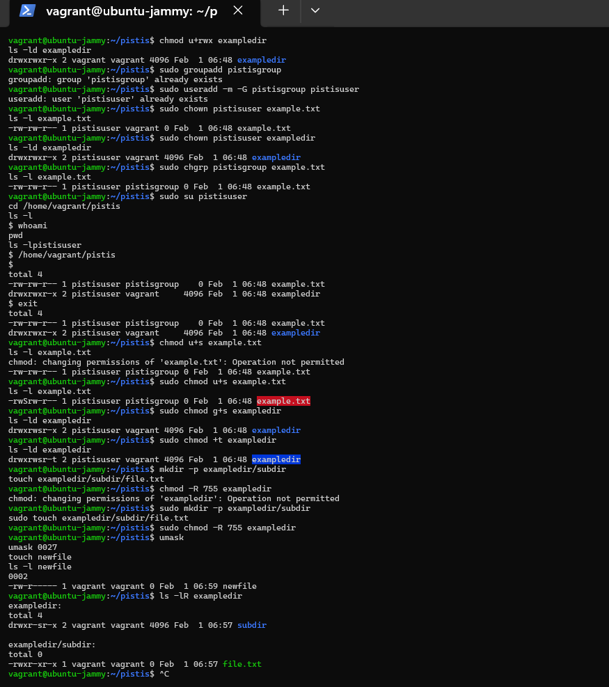
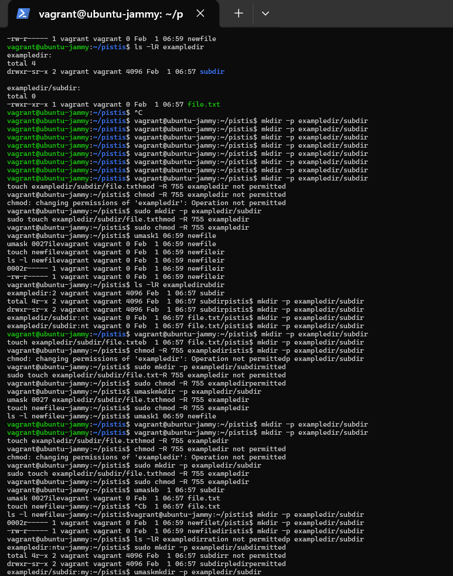
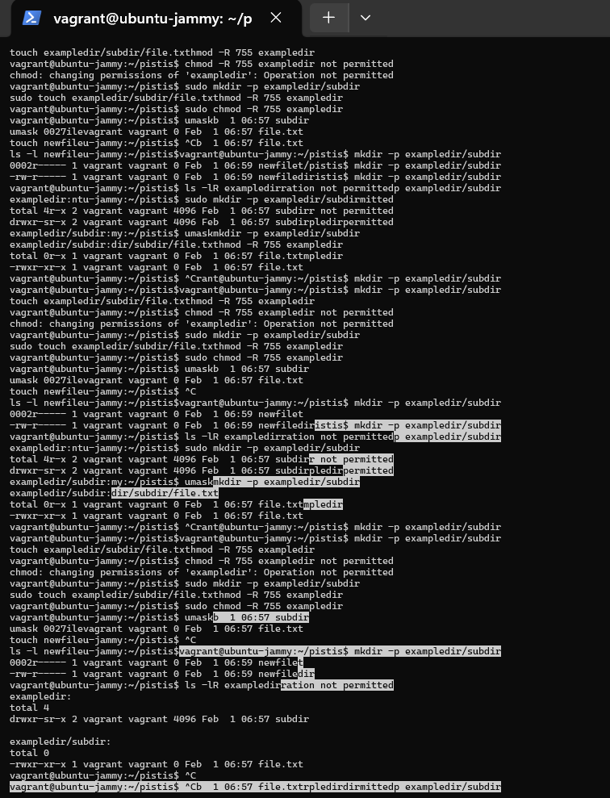

# File and Directory Permissions Lab Report

## Introduction

For this lab, I worked on a Linux system using a Vagrant virtual machine
running Ubuntu. The goal was to understand how Linux handles file and
directory permissions, ownership, users, and groups. I followed the lab
guide step by step and verified each change using terminal commands.

------------------------------------------------------------------------

## Setting Up the Working Directory

After logging into the virtual machine with `vagrant ssh`, I created a
directory called `pistis` in my home folder and moved into it. I did
this to keep all the lab work in one place and avoid affecting other
files on the system.

Inside the `pistis` directory, I created:

-   A file called `example.txt`
-   A directory called `exampledir`

When I ran:

``` bash
ls -l
```

I could see that both were owned by the `vagrant` user and group, which
is expected since that's the default user in the VM.

------------------------------------------------------------------------

## Changing File and Directory Permissions

Next, I used `chmod` to modify permissions.

For `example.txt`, I added read and write permissions for the owner.
When I checked the output with `ls -l`, I could see that the owner
permissions were correctly set.

For `exampledir`, I added read, write, and execute permissions for the
owner. This is important because directories need execute permission to
be accessed. The output confirmed that the directory permissions changed
as expected.

At this stage, I was mainly getting comfortable reading permission
strings like:

    -rw-rw-r--
    drwxrwxr-x

------------------------------------------------------------------------

## Creating a Group and User

After that, I created:

-   A new group called `pistisgroup`
-   A new user called `pistisuser`

I added the user to the group. This step was important because file
permissions in Linux often depend on both users and groups.

When I ran the commands again later, the system told me the user and
group already existed. This simply meant I had already created them
earlier --- no problem there.

------------------------------------------------------------------------

## Changing Ownership of Files and Directories

Next, I changed the ownership of `example.txt` and `exampledir` to
`pistisuser` using `chown`.

When I listed the files again, I could clearly see that the owner column
had changed from `vagrant` to `pistisuser`. That confirmed the ownership
change worked.

I then changed the group ownership of `example.txt` to `pistisgroup`
using `chgrp`. After running `ls -l`, the file showed:

-   Owner: `pistisuser`
-   Group: `pistisgroup`

This was exactly what I expected.


## Testing Access as the New User

To confirm that permissions were actually being enforced, I switched to
the new user using:

``` bash
sudo su pistisuser
```

While logged in as `pistisuser`, I navigated back to the `pistis`
directory and listed the files. I was able to see and access the files
without any permission errors, which showed that the ownership and
permissions were working correctly.

After confirming this, I exited back to the `vagrant` user.


## Working with Special Permissions

### Setuid

I tried to set the setuid bit on `example.txt`. At first, I got an:

    Operation not permitted

error. This happened because the file was owned by `pistisuser`, and I
was logged in as `vagrant`.

Once I reran the command with `sudo`, it worked. The permission string
changed to show a capital `S`, which told me the setuid bit was set but
the file wasn't executable. That matched what I expected.


### Setgid

Next, I set the setgid bit on `exampledir`. When I checked the
permissions, I saw an `s` in the group execute position. This confirmed
that new files created inside the directory would inherit the
directory's group.


### Sticky Bit

Then I added the sticky bit to `exampledir`. After listing the
directory, I saw a `t` at the end of the permission string. This
indicated that only file owners would be able to delete their own files
inside the directory.


## Recursive Permissions

To demonstrate recursive permissions, I created a subdirectory and a
file inside `exampledir`.

When I first ran:

``` bash
chmod -R 755 exampledir
```

I got another:

    Operation not permitted

error. This made sense because the directory was owned by `pistisuser`.

After running the same command with `sudo`, it worked. When I listed
everything recursively, I could see that:

-   Directories had `drwxr-xr-x`
-   Files had `-rwxr-xr-x`

This showed that the recursive permission change applied correctly to
all subdirectories and files.


## Default Permissions Using `umask`

Finally, I checked the system's current `umask`, which was:

    0002

I then changed it to:

    0027

and created a new file called `newfile`.

When I listed `newfile`, its permissions were:

    -rw-r-----

This showed that the `umask` setting was working as expected by
restricting access for others.


Overall, this lab helped me understand how Linux controls access to
files and directories. By creating users and groups, changing ownership,
modifying permissions, and testing access, I was able to see how each
command affects real system behavior.

The errors I encountered, like "Operation not permitted," were actually
helpful because they reinforced how ownership and privileges work in
Linux.

below are screenshots of my interface 







