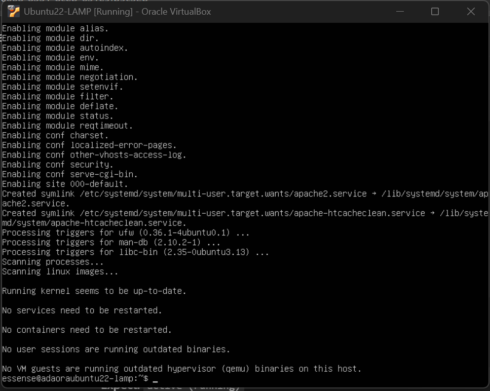
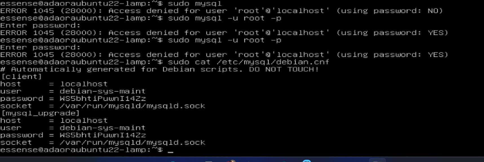
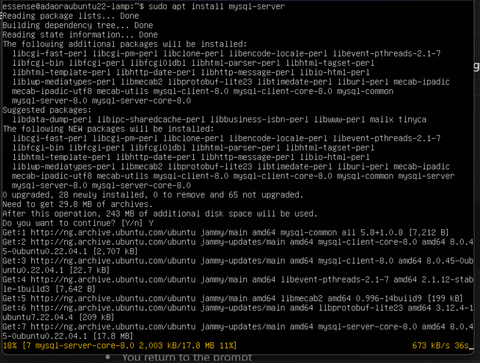
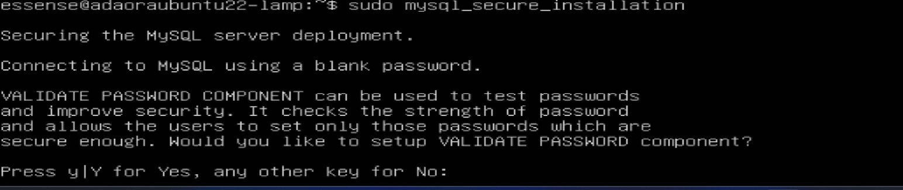
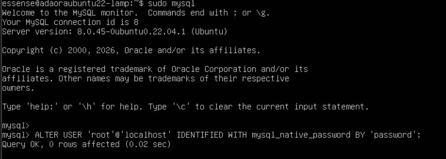
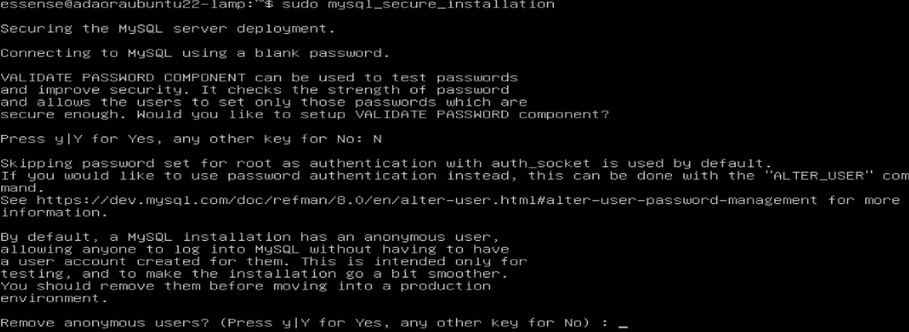
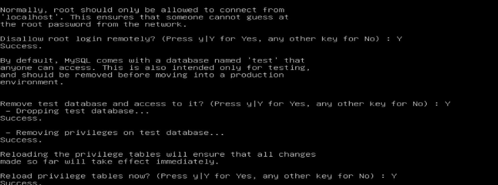
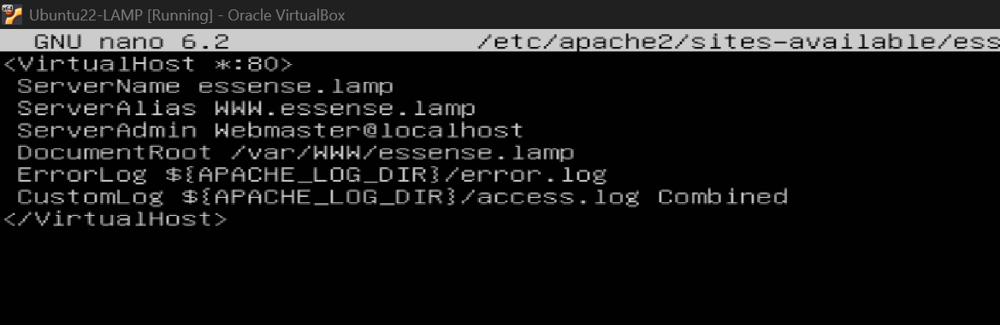
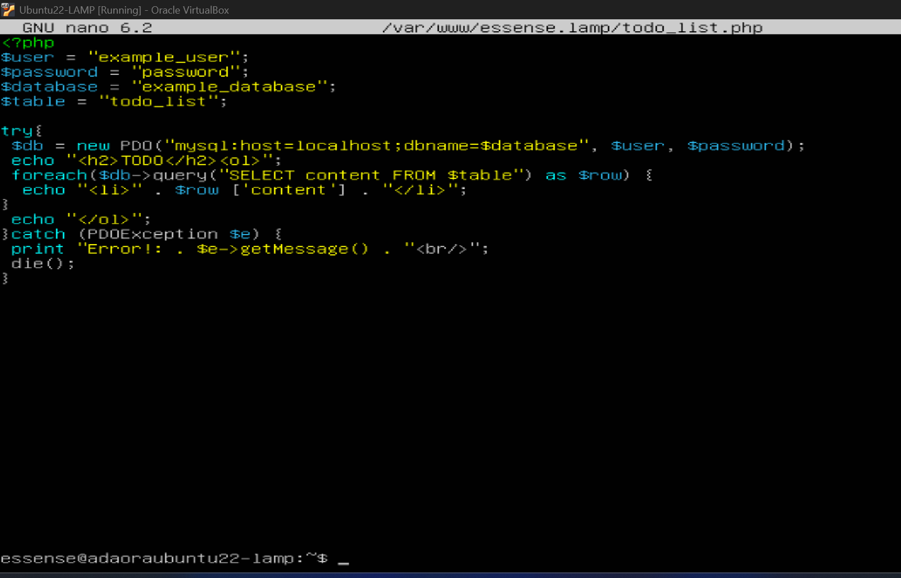
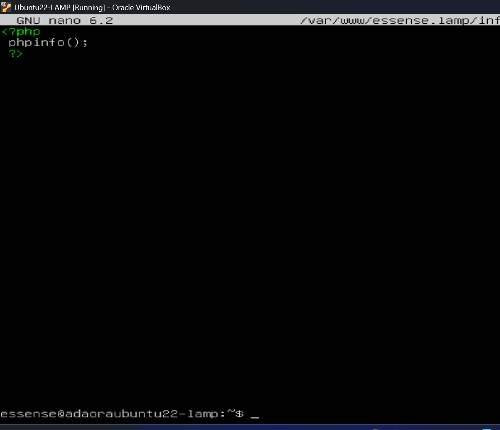

# LAMP Stack Lab Project Report

## Project Purpose

The purpose of this project was to set up a working **LAMP stack** on an Ubuntu virtual machine so that I could host a simple dynamic website.

In simple terms, I was trying to turn my Ubuntu VM into a mini web server that could:

- Serve web pages (using Apache)
- Store data (using MySQL)
- Run dynamic code (using PHP)

By the end, I wanted to open a browser and see a PHP page pulling data from a database.

---

## Step 1 – Installing Apache (Making the server able to show websites)

At the beginning of the lab, my Ubuntu VM was just a basic operating system. It couldn’t host websites yet.

So the first thing I did was install **Apache**, which is the software responsible for serving web pages to browsers.

sudo apt update  
sudo apt install apache2  

This turned my VM into a web server capable of serving web pages.

---

## Step 2 – Installing MySQL (Adding storage for data)

Next, I installed **MySQL**, which is the database system.

sudo apt install mysql-server  

The purpose of this step was to allow the website to store and retrieve data dynamically.

---

## The Blocker – MySQL Authentication Failure

When I tried to log into MySQL as the root user, I received:

ERROR 1045 (28000): Access denied for user 'root'@'localhost'

This prevented me from configuring the database and completely blocked my progress.

### Why It Happened

Ubuntu configures MySQL to use auth_socket authentication instead of password authentication for the root user. That means MySQL root login is tied to Linux system permissions rather than a password.

### How I Solved It

I accessed MySQL using the Debian maintenance configuration file:

sudo mysql --defaults-file=/etc/mysql/debian.cnf  

Then I corrected the authentication method:

ALTER USER 'root'@'localhost' IDENTIFIED WITH auth_socket;  
FLUSH PRIVILEGES;  

After exiting and testing with:

sudo mysql  

The issue was resolved and I regained access.

---

## Step 3 – Securing MySQL

I ran:

sudo mysql_secure_installation  

This removed anonymous users, disabled remote root login, removed the test database, and reloaded privileges.

---

## Step 4 – Installing PHP (Making the website dynamic)

sudo apt install php libapache2-mod-php php-mysql -y  

This allowed Apache to process PHP files and enabled PHP to communicate with MySQL.

---

## Step 5 – Creating a Virtual Host

I created a configuration file:

<VirtualHost *:80>
    ServerName essense.lamp
    ServerAlias www.essense.lamp
    ServerAdmin webmaster@localhost
    DocumentRoot /var/www/essense.lamp
    ErrorLog ${APACHE_LOG_DIR}/error.log
    CustomLog ${APACHE_LOG_DIR}/access.log combined
</VirtualHost>

Then enabled the site and reloaded Apache.

---

## Step 6 – Creating the PHP Page

I created todo_list.php that connects to MySQL using PDO, retrieves data, and displays it in the browser.

This is where the full LAMP stack worked together:

Apache → PHP → MySQL → Browser

---

## Final Outcome

By the end of the lab:

- Apache was running
- MySQL was secured and accessible
- PHP was installed
- A virtual host was configured
- A database-connected PHP page was created
- The MySQL authentication blocker was resolved

The Ubuntu VM was successfully transformed into a functioning web server.
