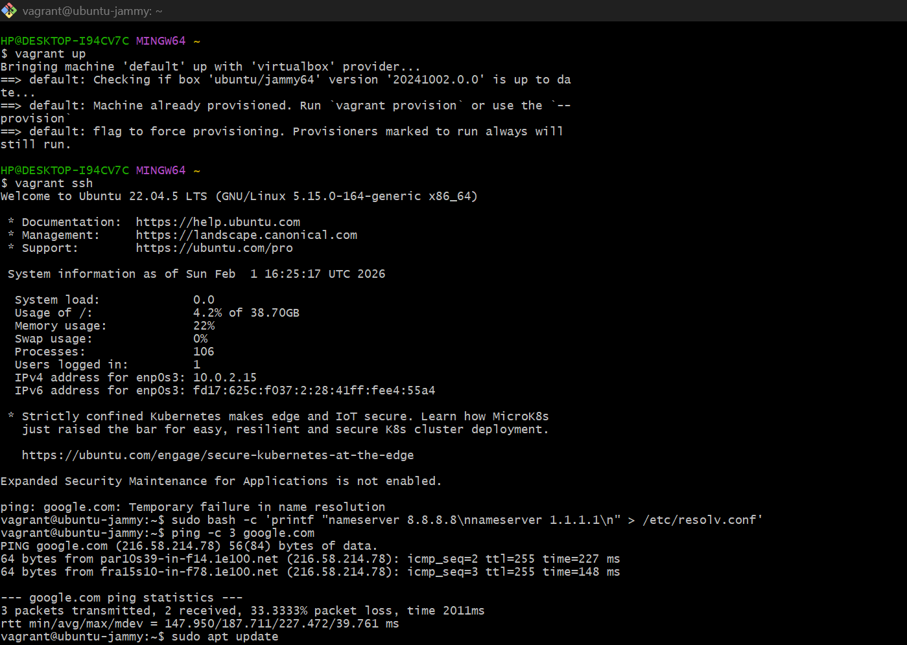
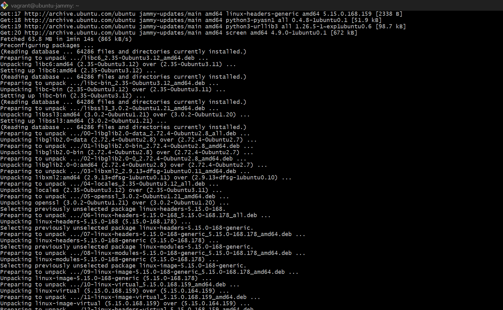
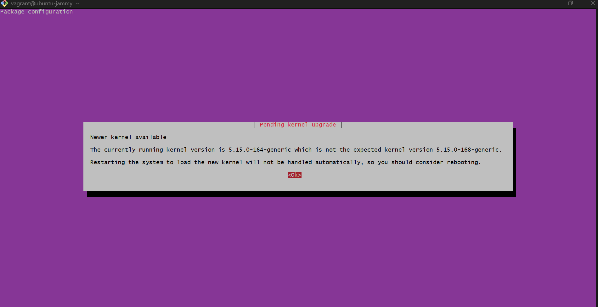
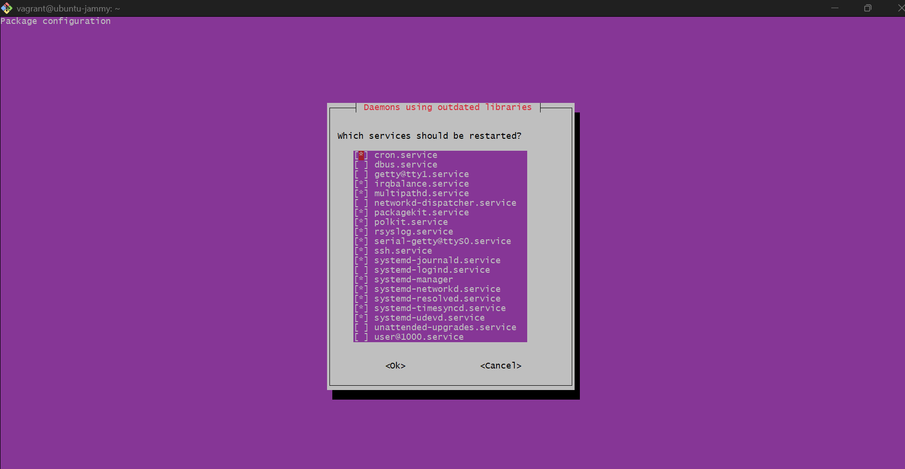

# Lab Report: Package Management on Linux

For this lab, I worked on a Linux package management project using a
Vagrant-based Ubuntu virtual machine. The main goal of the project was
to understand how software packages are managed on a Linux system using
apt. This included updating package repositories, installing and
upgrading software, searching for packages, and handling system updates.

------------------------------------------------------------------------

## Steps Performed

### 1. Accessing the Linux System

I started the project by launching and accessing the Ubuntu virtual
machine using Vagrant:

``` bash
vagrant up
vagrant ssh
```

Once connected, I confirmed that I was working in a Bash shell on
Ubuntu.

------------------------------------------------------------------------

### 2. Updating Package Repositories

Before installing or upgrading any software, I ran:

``` bash
sudo apt update
```

This step is important because it refreshes the system's package lists
so the system knows which versions of software are available.

------------------------------------------------------------------------

### Then Encountered an Issues

#### apt update Failed Due to DNS Errors

When I first ran `sudo apt update`, it failed with errors such as:

-   Temporary failure resolving 'archive.ubuntu.com'\
-   Temporary failure resolving 'security.ubuntu.com'

Even though the command itself was correct, the system could not reach
Ubuntu's repositories.

After troubleshooting, I found that The virtual machine had internet
connectivity, but DNS resolution was not working.

I confirmed this by testing:

``` bash
ping 8.8.8.8
```

and it worked, showing that the VM could reach the internet by IP
address but

``` bash
ping google.com
```

failed with a name resolution error, proving that DNS was the problem.

To fix the DNS problem, I manually configured DNS servers by editing the
resolver configuration:

``` bash
sudo bash -c 'printf "nameserver 8.8.8.8\nnameserver 1.1.1.1\n" > /etc/resolv.conf'
```

I looked it up a quick Google search and asking ChatGPT about that exact
error. The common explanation is that the machine has a DNS problem
meaning it can't translate website names like archive.ubuntu.com into IP
addresses so package downloads fail even if the internet connection
itself is working. A standard quick fix is to manually point the system
to reliable public DNS servers, so I ran:

``` bash
sudo bash -c 'printf "nameserver 8.8.8.8\nnameserver 1.1.1.1\n" > /etc/resolv.conf'
```

to replace the DNS settings with two known good servers Google DNS
(8.8.8.8) and Cloudflare DNS (1.1.1.1). I used sudo because
/etc/resolv.conf is a protected system file, and I used bash -c so the
\> redirect would also run with admin permissions. After doing that,
ping google.com started working and apt update was able to fetch
packages normally, which confirmed the DNS issue was fixed.

------------------------------------------------------------------------

### 3. Installing a Package (curl)

After fixing the DNS issue and successfully updating the repositories, I
installed curl:

``` bash
sudo apt install curl
```

The system reported that curl was already installed and up to date. I
verified it by running:

``` bash
curl --version
```

This confirmed the package was correctly installed.

------------------------------------------------------------------------

### 4. Upgrading the System

Next, I upgraded the system packages using:

``` bash
sudo apt upgrade
```

During the upgrade, Multiple packages and system libraries were updated,
A newer Linux kernel version was installed and The system prompted to
restart services using outdated libraries. I accepted the default
options to safely restart the services.

------------------------------------------------------------------------

### 5. Rebooting the System

Because a kernel upgrade was performed, the system prompted for a
reboot. I rebooted the VM using:

``` bash
sudo reboot
```

After rebooting and reconnecting with vagrant ssh, the system was
running the updated kernel, confirming the upgrade was fully applied.

------------------------------------------------------------------------

### 6. Searching for Packages

Finally, I switched back into the Ubuntu VM and ran:

``` bash
apt search "web server"
```

to check that the package search feature was working and to see what web
server-related packages were available in the repositories. The command
returned a long list of matching results, including apache2 (Apache HTTP
Server) and other web server-related packages, which confirmed that the
system could successfully query the repositories and that package
searching was working as expected.

------------------------------------------------------------------------

## Conclusion

This project successfully demonstrated how Linux package management
works using apt. In addition to the expected tasks, I encountered and
resolved a real-world issue involving DNS resolution, which prevented
package updates.

Below are screenshots of my work.









