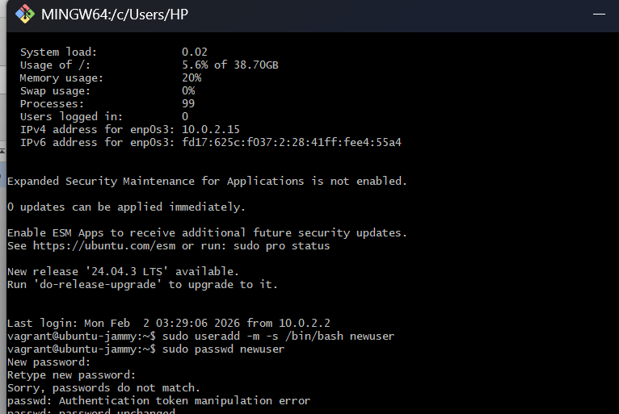
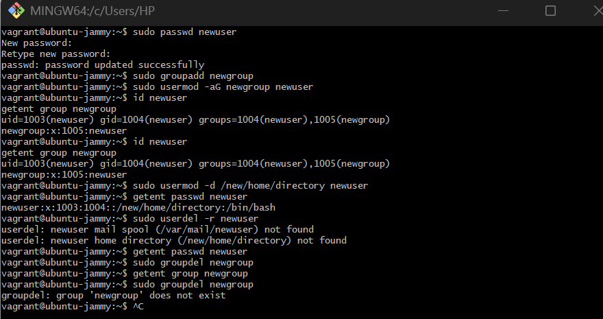

# User and Group Management Lab Report

The purpose of this lab was to practice Linux user and group management
by creating, modifying, verifying, and deleting user and group accounts
on a Vagrant Linux virtual machine.

Step 1 (Access the Linux system): I started the Vagrant virtual machine
and connected to it using `vagrant ssh`, which gave me terminal access
to the Linux system where I could run the lab commands.

Step 2 (Open a terminal): Once connected through SSH, I used the
terminal session to run all administration commands as the vagrant user
with sudo privileges.

Step 3 (Create a new user): I created a new user account so I could
manage a real user during the lab. I ran
`sudo useradd -m -s /bin/bash newuser`, -m creates a home directory for
the user (so it's a complete user setup), -s /bin/bash sets Bash as the
user's shell and the command produced no output, which is normal when
the user is created successfully.

Step 4 (Set a password for the new user): I set the user's password
using `sudo passwd newuser`. On the first attempt, I received "Sorry,
passwords do not match" because Linux does not display password
characters as you type, and I accidentally entered different passwords.
I fixed it by running the command again and entering the same password
twice, after which the system confirmed "password updated successfully."

Step 5 (Create a new group): I created a new group using
`sudo groupadd newgroup`. The command returned no output, which
indicated it ran successfully.

Step 6 (Add user to a group): I added the user to the group using
`sudo usermod -aG newgroup newuser`. There was no output, which is
normal, and it indicated the user was added to the group.

Step 7 (Verify user and group creation): I verified the setup using
`id newuser` and `getent group newgroup`. The outputs confirmed the user
existed and that newuser was a member of newgroup.

Step 8 (Modify user information): I changed the user's home directory
path using `sudo usermod -d /new/home/directory newuser`. I verified the
change using `getent passwd newuser`, which showed the updated home
directory field in the user's account entry.

Step 9 (Delete the user): I deleted the user using
`sudo userdel -r newuser`. The system displayed warnings that the mail
spool and home directory were not found. These occurred because the user
never logged in (so no mail spool file was created) and because the home
directory path was set to /new/home/directory, which did not exist as an
actual folder. I confirmed the user was deleted by running
`getent passwd newuser` and seeing no output.

Step 10 (Delete the group): I deleted the group using
`sudo groupdel newgroup` and verified it was removed by running
`getent group newgroup`, which returned no output. When I ran
`groupdel newgroup` again, it responded that the group did not exist,
which confirmed it had already been deleted.

I completed the lab by creating a user and group, assigning a password,
adding the user to the group, verifying the configuration, modifying the
user's home directory setting, and then deleting both the user and the
group. The main issue I encountered was the initial password mismatch,
which I resolved by re-running the password command and entering
matching values. I also received expected warnings during user deletion
because certain files/directories did not exist, and I confirmed
successful deletion using system lookup commands.

below are screen shots of my gitbash interface

